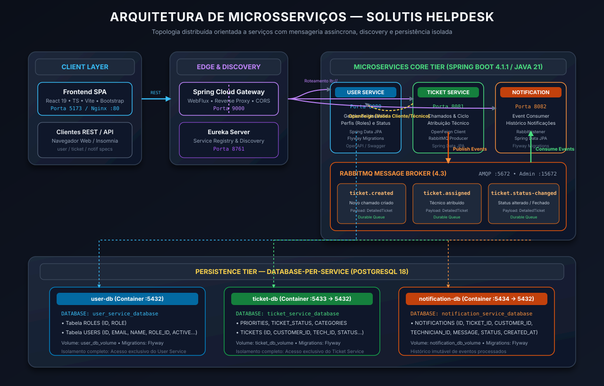
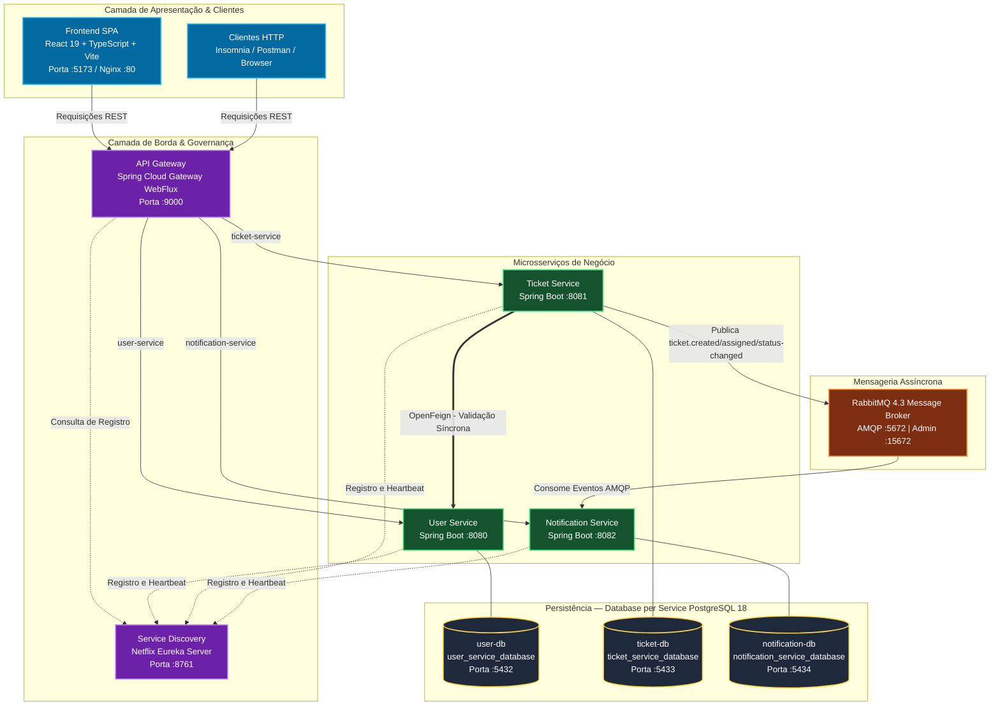
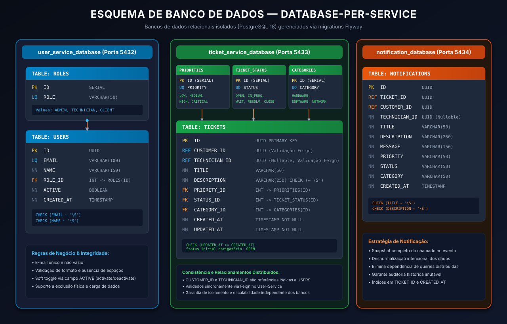
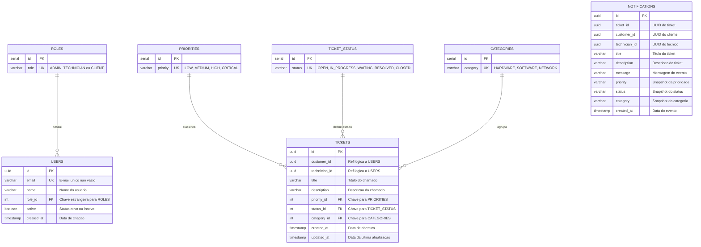

# Solutis-Helpdesk

Solutis Helpdesk application challenge

# Solutis Helpdesk — Plataforma Distribuída de Gestão de Chamados

[](https://www.oracle.com/java/)
[](https://spring.io/projects/spring-boot)
[](https://spring.io/projects/spring-cloud)
[](https://react.dev/)
[](https://www.rabbitmq.com/)
[](https://www.postgresql.org/)
[](https://www.docker.com/)

---

## 📑 Sumário

- [1. Descrição do Sistema](#1-descrição-do-sistema)
- [2. Arquitetura e Decisões Arquiteturais](#2-arquitetura-e-decisões-arquiteturais)
  - [2.1 Diagrama de Arquitetura](#21-diagrama-de-arquitetura)
  - [2.2 Responsabilidades dos Microsserviços](#22-responsabilidades-dos-microsserviços)
  - [2.3 Principais Decisões Arquiteturais](#23-principais-decisões-arquiteturais)
- [3. Tecnologias Utilizadas](#3-tecnologias-utilizadas)
- [4. Microsserviços, Endpoints e Estratégia de Persistência](#4-microsserviços-endpoints-e-estratégia-de-persistência)
  - [4.1 Esquema dos Bancos de Dados](#41-esquema-dos-bancos-de-dados)
  - [4.2 User Service](#42-user-service)
  - [4.3 Ticket Service](#43-ticket-service)
  - [4.4 Notification Service](#44-notification-service)
  - [4.5 Solutis Helpdesk Gateway](#45-solutis-helpdesk-gateway)
  - [4.6 Eureka Server](#46-eureka-server)
  - [4.7 Frontend App](#47-frontend-app)
- [5. Mensageria e Eventos RabbitMQ](#5-mensageria-e-eventos-rabbitmq)
- [6. Pré-requisitos e Instruções de Execução](#6-pré-requisitos-e-instruções-de-execução)
  - [6.1 Pré-requisitos](#61-pré-requisitos)
  - [6.2 Clonagem e Inicialização dos Submódulos](#62-clonagem-e-inicialização-dos-submódulos)
  - [6.3 Execução com Docker Compose](#63-execução-com-docker-compose)
  - [6.4 URLs de Acesso e Dashboards](#64-urls-de-acesso-e-dashboards)
  - [6.5 Execução Individual em Ambiente Local](#65-execução-individual-em-ambiente-local)
  - [6.6 Coleções de API para Testes (Insomnia)](#66-coleções-de-api-para-testes-insomnia)

---

## 1. Descrição do Sistema

O **Solutis Helpdesk** é uma solução corporativa distribuída projetada para modernizar e orquestrar o ciclo completo de atendimento técnico e suporte em ambientes corporativos. O sistema atende à demanda de abertura, triagem, categorização, priorização, atribuição e resolução de incidentes e solicitações de serviços de TI.

### Atores e Perfis de Acesso

- **Cliente (`CLIENT`):** Usuário final requisitante. Pode registrar novos chamados, acompanhar o progresso das suas solicitações e consultar o histórico de notificações geradas.
- **Técnico (`TECHNICIAN`):** Especialista de suporte. Responsável por assumir ou receber a atribuição de chamados, atualizar os status operacionais (em andamento, aguardando insumos, resolvido) e conduzir a solução técnica.
- **Administrador (`ADMIN`):** Gestor do sistema. Possui visibilidade global dos chamados, gerencia cadastros de usuários, ativa/desativa contas e acompanha métricas operacionais.

### Ciclo de Vida do Chamado (Ticket)

1. **Abertura:** O chamado é criado com status obrigatório inicial `OPEN`, associado a um cliente válido e ativo, com título, descrição, categoria (`HARDWARE`, `SOFTWARE` ou `NETWORK`) e prioridade (`LOW`, `MEDIUM`, `HIGH`, `CRITICAL`).
2. **Atribuição:** Um técnico com perfil `TECHNICIAN` ativo é atribuído ao chamado.
3. **Atendimento & Transições:** O ticket pode transitar entre os status `IN_PROGRESS` e `WAITING`.
4. **Resolução e Fechamento:** Ao concluir o atendimento, o chamado atinge o status `RESOLVED` ou é finalizado diretamente através do endpoint de fechamento com status `CLOSED`.
5. **Notificação Desacoplada:** Cada transição de estado relevante emite um evento no message broker, garantindo auditoria e notificações em tempo hábil para os envolvidos sem bloquear a operação principal.

---

## 2. Arquitetura e Decisões Arquiteturais

A solução foi estruturada sob o paradigma de **Arquitetura Orientada a Microsserviços (Microservices Architecture)**, combinando comunicação síncrona para validações transacionais essenciais e comunicação assíncrona orientada a eventos (_Event-Driven Architecture_) para tarefas secundárias e desacopladas.

### 2.1 Diagrama de Arquitetura





---

### 2.2 Responsabilidades dos Microsserviços

| Microsserviço                | Porta  | Descrição & Responsabilidades                                                                                                                                                                                                         |
| ---------------------------- | ------ | ------------------------------------------------------------------------------------------------------------------------------------------------------------------------------------------------------------------------------------- |
| **Eureka Server**            | `8761` | Servidor de descoberta de serviços (_Service Registry_). Monitora instâncias vivas, metadados e resolve endereços IP dinamicamente para balanceamento no lado do cliente.                                                             |
| **Solutis Helpdesk Gateway** | `9000` | Ponto de entrada único (_Single Point of Entry_) baseado em Spring Cloud Gateway reativo (WebFlux). Aplica _reverse proxy_, reescrita/remoção de prefixos (`StripPrefix=1`), políticas centralizadas de CORS e métricas via Actuator. |
| **User Service**             | `8080` | Gerenciamento de ciclo de vida de usuários, validação de regras de unicidade de e-mail, controle de perfis de acesso (`ADMIN`, `TECHNICIAN`, `CLIENT`), ativação e inativação lógica.                                                 |
| **Ticket Service**           | `8081` | Core de chamados da aplicação. Controla abertura, ciclo de vida, transições de status, prioridade e categoria. Executa validações no `User Service` via OpenFeign e dispara eventos de domínio no RabbitMQ.                           |
| **Notification Service**     | `8082` | Serviço de eventos e auditoria. Escuta filas do RabbitMQ de forma assíncrona, desnormaliza snapshots das notificações e fornece endpoints de consulta para histórico de chamados.                                                     |
| **Frontend SPA**             | `5173` | Aplicação web interativa para clientes e atendentes construída em React 19, TypeScript e Bootstrap 5.                                                                                                                                 |

---

### 2.3 Principais Decisões Arquiteturais

1. **Database-per-Service:**
   - Cada microsserviço possui sua própria instância de banco de dados física/lógica dedicada (`user_service_database`, `ticket_service_database`, `notification_service_database`).
   - Não há compartilhamento direto de tabelas nem _joins_ entre bancos em nível SQL, prevenindo acoplamento de esquema e viabilizando escalabilidade independente.
2. **Comunicação Híbrida (Síncrona + Assíncrona):**
   - **Síncrona via OpenFeign:** Utilizada pelo `Ticket Service` para consultar o `User Service` no momento em que um chamado é aberto ou atribuído. Se o cliente ou técnico não existir, estiver inativo ou não possuir o perfil correto, a transação do chamado é abortada imediatamente com código HTTP 400.
   - **Assíncrona via RabbitMQ:** Utilizada para notificações de auditoria. O `Ticket Service` não aguarda o processamento do envio de notificações para responder à requisição do usuário; ele apenas entrega a mensagem ao broker com garantia de persistência (filas duráveis).
3. **API Gateway & Roteamento Unificado:**
   - Os clientes externos interagem exclusivamente com a porta `9000` (`/user-service/**`, `/ticket-service/**`, `/notification-service/**`).
   - Evita expor portas internas de microsserviços na internet, isola a topologia da rede interna e centraliza políticas de CORS.
4. **Descoberta Dinâmica com Netflix Eureka:**
   - As rotas do gateway utilizam URIs no formato `lb://<service-name>`, permitindo escalabilidade horizontal com balanceamento de carga automático (_client-side load balancing_).
5. **Estratégia de Notificação com Snapshots Desnormalizados:**
   - O `Notification Service` salva um snapshot com os dados do ticket (`TITLE`, `DESCRIPTION`, `PRIORITY`, `STATUS`, `CATEGORY`, `CUSTOMER_ID`, `TECHNICIAN_ID`) junto à mensagem. Isso evita a necessidade de efetuar chamadas síncronas adicionais ao banco de chamados durante a visualização de histórico.
6. **Migrações Automatizadas com Flyway:**
   - O ciclo de vida dos esquemas SQL é versionado via código (`V1__create_tables.sql`). A cada inicialização, os microsserviços executam as migrações automaticamente, garantindo paridade total entre ambientes locais, de teste e de produção.

---

## 3. Tecnologias Utilizadas

| Camada / Função               | Tecnologia                     | Versão        | Finalidade                                                                |
| ----------------------------- | ------------------------------ | ------------- | ------------------------------------------------------------------------- |
| **Linguagem Principal**       | Java                           | 21 (LTS)      | Base de desenvolvimento de todos os microsserviços backend                |
| **Framework Backend**         | Spring Boot                    | 4.1.1         | Framework de injeção de dependência, auto-configuração e execução         |
| **Ecossistema Cloud**         | Spring Cloud                   | 2025.1.3      | Integração com Eureka, Gateway e OpenFeign                                |
| **Service Discovery**         | Spring Cloud Netflix Eureka    | 2025.1.3      | Descoberta e registro dinâmico de serviços                                |
| **API Gateway**               | Spring Cloud Gateway (WebFlux) | 5.0.3         | Roteamento reativo, reverse proxy e CORS                                  |
| **Comunicação Declarativa**   | Spring Cloud OpenFeign         | 2025.1.3      | Cliente HTTP síncrono tipado entre microsserviços                         |
| **Mensageria / AMQP**         | RabbitMQ                       | 4.3           | Broker de mensagens para entrega de eventos duráveis                      |
| **Spring AMQP**               | Spring Boot Starter AMQP       | 4.1.1         | Abstração de templates (`RabbitTemplate`) e listeners (`@RabbitListener`) |
| **Banco de Dados Relacional** | PostgreSQL                     | 18 (Bookworm) | Sistema de gerenciamento de banco de dados relacional (3 instâncias)      |
| **Persistência & ORM**        | Spring Data JPA / Hibernate    | 4.1.1         | Mapeamento objeto-relacional e abstração de repositórios                  |
| **Migrações de Esquema**      | Flyway                         | 4.1.1         | Controle de versão e inicialização declarativa de bancos de dados         |
| **Validação de Dados**        | Jakarta Bean Validation        | 3.0+          | Validações declarativas em DTOs (`@NotNull`, `@NotBlank`, `@Size`)        |
| **Documentação de API**       | SpringDoc OpenAPI (Swagger UI) | 3.1.0         | Geração automática de especificações OpenAPI 3 e documentação interativa  |
| **Produtividade Java**        | Lombok                         | 1.18+         | Redução de boilerplate (Getters, Setters, Construtores)                   |
| **Frontend Framework**        | React                          | 19.2.8        | Construção da interface do usuário em SPA reativa                         |
| **Tipagem Frontend**          | TypeScript                     | ~6.0.2        | Tipagem estática segura no frontend                                       |
| **Build & Bundler Web**       | Vite                           | 8.3.0         | Empacotamento ultrarrápido e Hot Module Replacement (HMR)                 |
| **Estilização Frontend**      | Bootstrap                      | 5.3.8         | Framework de componentes visuais e design responsivo                      |
| **Roteamento SPA**            | React Router DOM               | 7.18.4        | Roteamento de telas e navegação no frontend                               |
| **Formulários Web**           | React Hook Form                | 7.88.0        | Gerenciamento de estado de formulários e validações no cliente            |
| **Servidor Web Frontend**     | Nginx                          | Alpine        | Servidor web para entrega dos arquivos estáticos da SPA em container      |
| **Containerização**           | Docker & Docker Compose        | v2+           | Isolamento de ambientes, redes e orquestração de containers               |

---

## 4. Microsserviços, Endpoints e Estratégia de Persistência

### 4.1 Esquema dos Bancos de Dados

O diagrama abaixo ilustra o modelo relacional dos três bancos de dados independentes e suas restrições de integridade.





---

### 4.2 User Service

- **Porta Direta:** `8080`
- **Prefixo no Gateway:** `http://localhost:9000/user-service`
- **Banco de Dados:** `user_service_database` (Porta externa `:5432`)
- **Estratégia de Persistência:**
  - Banco relacional PostgreSQL 18 gerenciado por Flyway (`V1__create_tables.sql`).
  - Tabela `ROLES` pré-populada com `ADMIN`, `TECHNICIAN` e `CLIENT`.
  - Tabela `USERS` com chave primária UUID gerada em aplicação, garantia de e-mail único, verificação com expressões regulares contra strings vazias (`CHECK (~ '\S')`) e exclusão lógica por campo booleano `ACTIVE`.

#### Endpoints do User Service

| Método   | Endpoint Direto          | Endpoint via Gateway                  | Descrição                                                               | Corpo da Requisição | Respostas                                                |
| -------- | ------------------------ | ------------------------------------- | ----------------------------------------------------------------------- | ------------------- | -------------------------------------------------------- |
| `POST`   | `/users`                 | `/user-service/users`                 | Cadastra um novo usuário no sistema                                     | `UserData` (JSON)   | `201 Created` (com header `Location`), `400 Bad Request` |
| `GET`    | `/users`                 | `/user-service/users`                 | Lista usuários paginados (default: size 10)                             | _Nenhum_            | `200 OK` (`Page<ListUserData>`)                          |
| `GET`    | `/users/{id}`            | `/user-service/users/{id}`            | Busca os detalhes de um usuário por UUID                                | _Nenhum_            | `200 OK` (`ListUserData`), `400 Bad Request`             |
| `GET`    | `/users/role/{role}`     | `/user-service/users/role/{role}`     | Lista usuários com determinado perfil (`ADMIN`, `TECHNICIAN`, `CLIENT`) | _Nenhum_            | `200 OK` (`Page<ListUserData>`), `400 Bad Request`       |
| `PUT`    | `/users/{id}`            | `/user-service/users/{id}`            | Atualiza nome, e-mail e perfil do usuário                               | `UserData` (JSON)   | `200 OK` (`DetailedUserData`), `400 Bad Request`         |
| `POST`   | `/users/{id}/activate`   | `/user-service/users/{id}/activate`   | Ativa um usuário previamente inativo                                    | _Nenhum_            | `200 OK` (`UserActivityStatusData`), `400 Bad Request`   |
| `POST`   | `/users/{id}/deactivate` | `/user-service/users/{id}/deactivate` | Desativa um usuário ativo                                               | _Nenhum_            | `200 OK` (`UserActivityStatusData`), `400 Bad Request`   |
| `DELETE` | `/users/{id}`            | `/user-service/users/{id}`            | Realiza a exclusão física do registro                                   | _Nenhum_            | `204 No Content`, `400 Bad Request`                      |
| `GET`    | `/load-data`             | `/user-service/load-data`             | Executa a carga de dados iniciais de teste                              | _Nenhum_            | `200 OK` (`List<DetailedUserData>`)                      |

##### Exemplo de Payload para Criação (`POST /users`):

```json
{
  "name": "Maria Silva",
  "email": "maria.silva@empresa.com",
  "role": {
    "role": "CLIENT"
  }
}
```

---

### 4.3 Ticket Service

- **Porta Direta:** `8081`
- **Prefixo no Gateway:** `http://localhost:9000/ticket-service`
- **Banco de Dados:** `ticket_service_database` (Porta externa `:5433`, interna `:5432`)
- **Estratégia de Persistência:**
  - PostgreSQL 18 gerenciado por Flyway (`V1__create_tables.sql`).
  - Tabelas de lookup: `PRIORITIES` (`LOW`, `MEDIUM`, `HIGH`, `CRITICAL`), `TICKET_STATUS` (`OPEN`, `IN_PROGRESS`, `WAITING`, `RESOLVED`, `CLOSED`) e `CATEGORIES` (`HARDWARE`, `SOFTWARE`, `NETWORK`).
  - Tabela principal `TICKETS` com chave primária UUID, restrição `UPDATED_AT >= CREATED_AT`, e referências lógicas a usuários validadas pelo `UserServiceClient` (OpenFeign).
- **Emissão de Eventos:** Após transações bem-sucedidas em banco, injeta eventos no RabbitMQ via `TicketMessageSender`.

#### Endpoints do Ticket Service

| Método   | Endpoint Direto                  | Endpoint via Gateway                            | Descrição                                                            | Corpo da Requisição       | Respostas                                               |
| -------- | -------------------------------- | ----------------------------------------------- | -------------------------------------------------------------------- | ------------------------- | ------------------------------------------------------- |
| `POST`   | `/tickets`                       | `/ticket-service/tickets`                       | Cria um novo chamado técnico (Status inicial: `OPEN`)                | `TicketData` (JSON)       | `201 Created` (`DetailedTicketData`), `400 Bad Request` |
| `GET`    | `/tickets`                       | `/ticket-service/tickets`                       | Lista todos os chamados paginados                                    | _Nenhum_                  | `200 OK` (`Page<ListTicketData>`)                       |
| `GET`    | `/tickets/{id}`                  | `/ticket-service/tickets/{id}`                  | Recupera os detalhes de um chamado por UUID                          | _Nenhum_                  | `200 OK` (`ListTicketData`), `400 Bad Request`          |
| `GET`    | `/tickets/customer/{customerId}` | `/ticket-service/tickets/customer/{customerId}` | Lista chamados abertos por um cliente específico                     | _Nenhum_                  | `200 OK` (`Page<ListTicketData>`), `400 Bad Request`    |
| `PUT`    | `/tickets/{id}`                  | `/ticket-service/tickets/{id}`                  | Atualização completa de um chamado existente                         | `UpdateTicketData` (JSON) | `200 OK` (`DetailedTicketData`), `400 Bad Request`      |
| `PATCH`  | `/tickets/{id}/priority`         | `/ticket-service/tickets/{id}/priority`         | Atualiza exclusivamente a prioridade do chamado                      | `TicketPriorityData`      | `200 OK` (`DetailedTicketData`), `400 Bad Request`      |
| `PATCH`  | `/tickets/{id}/status`           | `/ticket-service/tickets/{id}/status`           | Atualiza o status do chamado (dispara evento)                        | `TicketStatusData`        | `200 OK` (`DetailedTicketData`), `400 Bad Request`      |
| `PATCH`  | `/tickets/{id}/category`         | `/ticket-service/tickets/{id}/category`         | Altera a categoria do chamado                                        | `TicketCategoryData`      | `200 OK` (`DetailedTicketData`), `400 Bad Request`      |
| `PATCH`  | `/tickets/{id}/technician`       | `/ticket-service/tickets/{id}/technician`       | Atribui um técnico ao chamado (valida perfil `TECHNICIAN` via Feign) | `AssignTechnicianData`    | `200 OK` (`DetailedTicketData`), `400 Bad Request`      |
| `POST`   | `/tickets/{id}/close`            | `/ticket-service/tickets/{id}/close`            | Encerra o chamado mudando o status para `CLOSED`                     | _Nenhum_                  | `200 OK` (`DetailedTicketData`), `400 Bad Request`      |
| `DELETE` | `/tickets/{id}`                  | `/ticket-service/tickets/{id}`                  | Exclusão definitiva do chamado                                       | _Nenhum_                  | `204 No Content`, `400 Bad Request`                     |
| `GET`    | `/load-data`                     | `/ticket-service/load-data`                     | Carrega massa inicial de tickets para testes                         | _Nenhum_                  | `200 OK`                                                |

##### Exemplo de Payload para Abertura (`POST /tickets`):

```json
{
  "customerId": "b5a4f3e2-d1c0-9b8a-7f6e-5d4c3b2a10fe",
  "title": "Problema com acesso à VPN",
  "description": "Não consigo conectar à rede interna após a troca de senha.",
  "priority": {
    "priority": "HIGH"
  },
  "category": {
    "category": "NETWORK"
  }
}
```

##### Exemplo de Atribuição de Técnico (`PATCH /tickets/{id}/technician`):

```json
{
  "technicianId": "e1f2a3b4-c5d6-7e8f-9a0b-1c2d3e4f5a6b"
}
```

---

### 4.4 Notification Service

- **Porta Direta:** `8082`
- **Prefixo no Gateway:** `http://localhost:9000/notification-service`
- **Banco de Dados:** `notification_service_database` (Porta externa `:5434`, interna `:5432`)
- **Estratégia de Persistência:**
  - Armazena histórico imutável de eventos processados pelo listener AMQP.
  - Registra a mensagem gerada e um snapshot com título, descrição, categoria, status e identificadores dos envolvidos.
  - Permite auditoria histórica sem acoplamento nem consultas distribuídas entre bancos.

#### Endpoints do Notification Service

| Método | Endpoint Direto                    | Endpoint via Gateway                                    | Descrição                                                    | Respostas                                        |
| ------ | ---------------------------------- | ------------------------------------------------------- | ------------------------------------------------------------ | ------------------------------------------------ |
| `GET`  | `/notifications`                   | `/notification-service/notifications`                   | Lista todas as notificações geradas paginadas                | `200 OK` (`Page<NotificationData>`)              |
| `GET`  | `/notifications/{id}`              | `/notification-service/notifications/{id}`              | Recupera os detalhes de uma notificação específica           | `200 OK` (`NotificationData`), `400 Bad Request` |
| `GET`  | `/notifications/ticket/{ticketId}` | `/notification-service/notifications/ticket/{ticketId}` | Lista todas as notificações associadas a determinado chamado | `200 OK` (`Page<NotificationData>`)              |

---

### 4.5 Solutis Helpdesk Gateway

- **Porta:** `9000`
- **Tecnologia:** Spring Cloud Gateway 5 (WebFlux Reativo)
- **Roteamento Dinâmico:**
  - `/user-service/**` $\rightarrow$ `lb://user-service` (com `StripPrefix=1`)
  - `/ticket-service/**` $\rightarrow$ `lb://ticket-service` (com `StripPrefix=1`)
  - `/notification-service/**` $\rightarrow$ `lb://notification-service` (com `StripPrefix=1`)
- **Endpoints de Gestão e Monitoramento (Spring Actuator):**
  - `GET /actuator/health`: Verifica a saúde do gateway e dos serviços vinculados.
  - `GET /actuator/gateway/routes`: Lista todas as rotas ativas registradas no gateway.

---

### 4.6 Eureka Server

- **Porta:** `8761`
- **Dashboard Web:** `http://localhost:8761`
- **API REST do Eureka:** `http://localhost:8761/eureka/apps`
- **Função:** Mantém o registro em tempo real de todas as instâncias de microsserviços ativas, monitorando a integridade por meio de _heartbeats_.

---

### 4.7 Frontend App

- **Porta no Host:** `5173` (mapeada internamente para a porta 80 do Nginx)
- **Tecnologias:** React 19, TypeScript, Vite, Bootstrap 5, React Router DOM v7.
- **Função:** Interface unificada para abertura e acompanhamento de chamados em tempo real, comunicando-se exclusivamente com a API Gateway (`http://localhost:9000`).

---

## 5. Mensageria e Eventos RabbitMQ

A mensageria assíncrona foi implementada para garantir resiliência operacional, permitindo que a geração de notificações e trilhas de auditoria ocorra sem reter as requisições HTTP do usuário.

### Configuração do Broker

- **Host:** `rabbitmq` (ou `localhost` fora do docker)
- **Porta AMQP:** `5672`
- **Painel Administrativo:** `http://localhost:15672` (Usuário: `admin` / Senha: `admin`)
- **Conversor de Mensagens:** `JacksonJsonMessageConverter` para serialização/desserialização JSON transparente.

### Filas, Routing Keys e Ações

| Fila / Routing Key      | Produtor        | Consumidor              | Momento do Disparo                                                                                                                  | Mensagem Gerada                                    |
| ----------------------- | --------------- | ----------------------- | ----------------------------------------------------------------------------------------------------------------------------------- | -------------------------------------------------- |
| `ticket.created`        | `TicketService` | `TicketServiceListener` | Logo após a criação e persistência do novo chamado (`POST /tickets`)                                                                | `"Ticket with id {id} created!"`                   |
| `ticket.assigned`       | `TicketService` | `TicketServiceListener` | Quando um técnico é atribuído ou atualizado (`PATCH /tickets/{id}/technician` ou `PUT /tickets/{id}`)                               | `"Technician with id {id} assigned!"`              |
| `ticket.status-changed` | `TicketService` | `TicketServiceListener` | Quando o status é alterado (`PATCH /tickets/{id}/status`), fechado (`POST /tickets/{id}/close`) ou atualizado (`PUT /tickets/{id}`) | `"Ticket with id {id} status changed to {status}"` |

#### Payload do Evento (Serializado em JSON):

```json
{
  "id": "13e377d2-be87-4541-b72b-70407c7dd7e4",
  "customerId": "b5a4f3e2-d1c0-9b8a-7f6e-5d4c3b2a10fe",
  "technicianId": "e1f2a3b4-c5d6-7e8f-9a0b-1c2d3e4f5a6b",
  "title": "Email password change",
  "description": "I forgot my email password again, sorry guys!",
  "priority": { "priority": "LOW" },
  "status": { "status": "IN_PROGRESS" },
  "category": { "category": "SOFTWARE" },
  "createdAt": "2026-09-24T18:00:00",
  "updatedAt": "2026-09-24T18:30:00"
}
```

---

## 6. Pré-requisitos e Instruções de Execução

### 6.1 Pré-requisitos

Para rodar todo o ecossistema com Docker Compose, é necessário:

- **Docker Desktop** ou **Docker Engine** (versão 24.0+) com plugin **Docker Compose v2** instalado e ativo.
- **Git** (versão 2.30+).
- Ao menos **4 GB de memória RAM livre** recomendada para subir todos os containers.

_(Opcional: Caso deseje compilar e executar os projetos Java ou o frontend fora do Docker)_:

- **Java JDK 21** (recomenda-se Eclipse Adoptium Temurin 21).
- **Apache Maven 3.9+** configurado no PATH.
- **Node.js 20+ ou 24+** e gerenciador de pacotes **npm**.

---

### 6.2 Clonagem e Inicialização dos Submódulos

Como os microsserviços são versionados como **Git Submodules**, clone o repositório utilizando a flag `--recurse-submodules`:

```bash
git clone --recurse-submodules https://github.com/caioCarmoAtSolutis/Solutis-Helpdesk.git
cd Solutis-Helpdesk
```

Se você já clonou o repositório sem a flag acima, inicialize os submódulos manualmente:

```bash
git submodule update --init --recursive
```

---

### 6.3 Execução com Docker Compose

O arquivo [`docker-compose.yml`](./docker-compose.yml) orquestra a inicialização coordenada de todos os serviços com dependências e checagens de integridade (_healthchecks_).

1. **Subir toda a infraestrutura e os serviços em segundo plano:**

   ```bash
   docker compose up --build -d
   ```

2. **Acompanhar os logs de inicialização:**

   ```bash
   docker compose logs -f
   ```

3. **Verificar o status e a saúde dos containers:**

   ```bash
   docker compose ps
   ```

4. **Encerrar a execução de todos os containers:**
   ```bash
   docker compose down
   ```
   _(Para remover também os volumes persistentes dos bancos de dados, utilize `docker compose down -v`)_.

---

### 6.4 URLs de Acesso e Dashboards

Após a inicialização completa dos containers, os seguintes serviços estarão disponíveis:

| Serviço / Aplicação             | URL no Navegador                                                                               | Credenciais / Notas                           |
| ------------------------------- | ---------------------------------------------------------------------------------------------- | --------------------------------------------- |
| **Frontend Web**                | [http://localhost:5173](http://localhost:5173)                                                 | Interface gráfica do Helpdesk                 |
| **API Gateway**                 | [http://localhost:9000](http://localhost:9000)                                                 | Ponto de entrada de todas as requisições REST |
| **Eureka Server Dashboard**     | [http://localhost:8761](http://localhost:8761)                                                 | Painel de monitoramento das instâncias ativas |
| **RabbitMQ Management**         | [http://localhost:15672](http://localhost:15672)                                               | **Usuário:** `admin` \| **Senha:** `admin`    |
| **Gateway Health Check**        | [http://localhost:9000/actuator/health](http://localhost:9000/actuator/health)                 | Status do Gateway e conexões                  |
| **Rotas Ativas no Gateway**     | [http://localhost:9000/actuator/gateway/routes](http://localhost:9000/actuator/gateway/routes) | Lista detalhada de roteamento reativo         |
| **Swagger UI — User Service**   | [http://localhost:8080/swagger-ui.html](http://localhost:8080/swagger-ui.html)                 | Documentação interativa dos usuários          |
| **Swagger UI — Ticket Service** | [http://localhost:8081/swagger-ui.html](http://localhost:8081/swagger-ui.html)                 | Documentação interativa dos chamados          |
| **Swagger UI — Notification**   | [http://localhost:8082/swagger-ui.html](http://localhost:8082/swagger-ui.html)                 | Documentação interativa das notificações      |

---

### 6.5 Execução Individual em Ambiente Local

Para depurar ou executar um serviço isolado em sua IDE (IntelliJ IDEA / VS Code):

1. **Suba previamente os bancos de dados e o broker:**

   ```bash
   docker compose up -d user-db ticket-db notification-db rabbitmq eureka-server gateway
   ```

2. **Defina as variáveis de ambiente necessárias (conforme `docker-compose.yml`):**
   - Para o **Ticket Service**:
     - `TICKET_DATABASE_URL=jdbc:postgresql://localhost:5433/ticket_service_database`
     - `POSTGRES_USER=postgres`
     - `POSTGRES_PASSWORD=postgres`
     - `EUREKA_SERVER_URL=http://localhost:8761/eureka/`
     - `USER_SERVICE_URL=http://localhost:9000/user-service/`
     - `RABBITMQ_HOST=localhost`
     - `RABBITMQ_PORT=5672`
     - `RABBITMQ_DEFAULT_USER=admin`
     - `RABBITMQ_DEFAULT_PASS=admin`
     - `TICKET_CREATED_ROUTING_KEY=ticket.created`
     - `TICKET_ASSIGNED_ROUTING_KEY=ticket.assigned`
     - `TICKET_STATUS_CHANGED_ROUTING_KEY=ticket.status-changed`

3. **Execução via Maven:**

   ```bash
   # Dentro da pasta do respectivo microsserviço:
   mvn spring-boot:run
   ```

4. **Execução do Frontend em modo desenvolvimento:**
   ```bash
   cd Solutis-Helpdesk-Frontend
   npm install
   npm run dev
   ```

---

### 6.6 Coleções de API para Testes (Insomnia)

O repositório já inclui coleções prontas e pré-configuradas para o **Insomnia REST Client**:

- [`user-service-endpoints.yaml`](./user-service-endpoints.yaml): Requisições prontas de criação, listagem, ativação/desativação e busca por perfil.
- [`ticket-service-endpoints.yaml`](./ticket-service-endpoints.yaml): Requisições de abertura, atribuição de técnico, transição de status, fechamento e filtros.
- [`notification-service-endpoints.yaml`](./notification-service-endpoints.yaml): Consultas ao histórico de notificações e logs por chamado.

Para utilizá-las, basta abrir o Insomnia e importar os arquivos `.yaml` via menu **Application $\rightarrow$ Import Data**.
